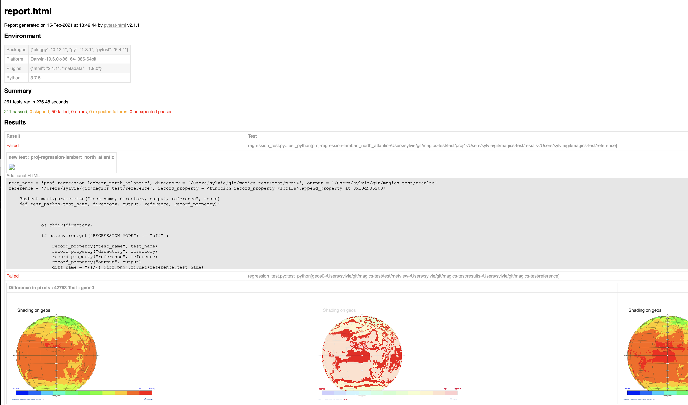

# Magics regression test suite

This test suite runs the regression tests for the [Magics](https://confluence.ecmwf.int/magics) meteorological plotting package. 

## Running the test suite

`pytest --html report.html`

A report is created in report.html , showing the visual difference between a reference set of images.   
An error is reported is the number of different pixels exceeds a certain threshold.

## Creating your own reference dataset.

A script can be used to generate the reference dataset for a specific Magics Version:  
`python make_reference.py`   

This will generate a png for each test in the *reference* directory.  
You can after that run the test suite using your new magics version.  
This will show you the visual differences bwteen the 2 versions.

## License

Copyright 2019- European Centre for Medium-Range Weather Forecasts (ECMWF).

Licensed under the Apache License, Version 2.0 (the "License"); you may not use this file except in compliance with the License. You may obtain a copy of the License at: http://www.apache.org/licenses/LICENSE-2.0 Unless required by applicable law or agreed to in writing, software distributed under the License is distributed on an "AS IS" BASIS, WITHOUT WARRANTIES OR CONDITIONS OF ANY KIND, either express or implied. See the License for the specific language governing permissions and limitations under the License.
